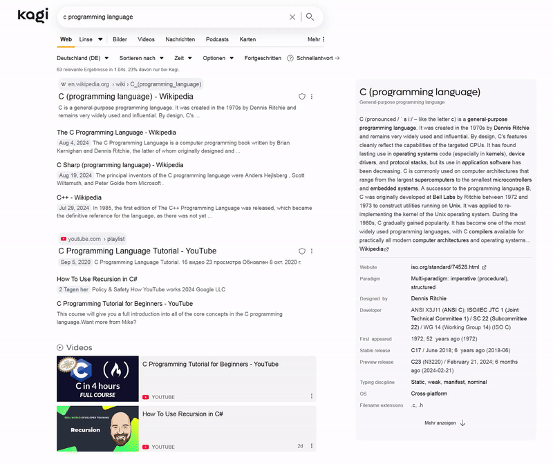
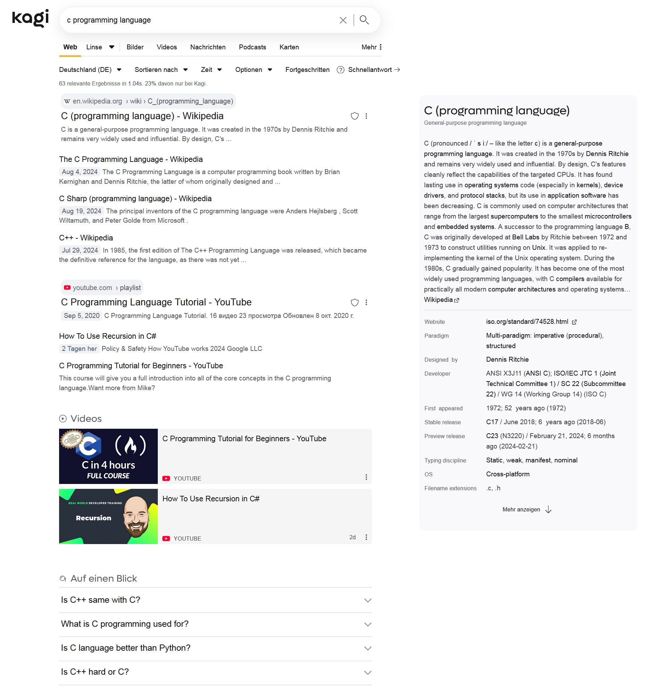
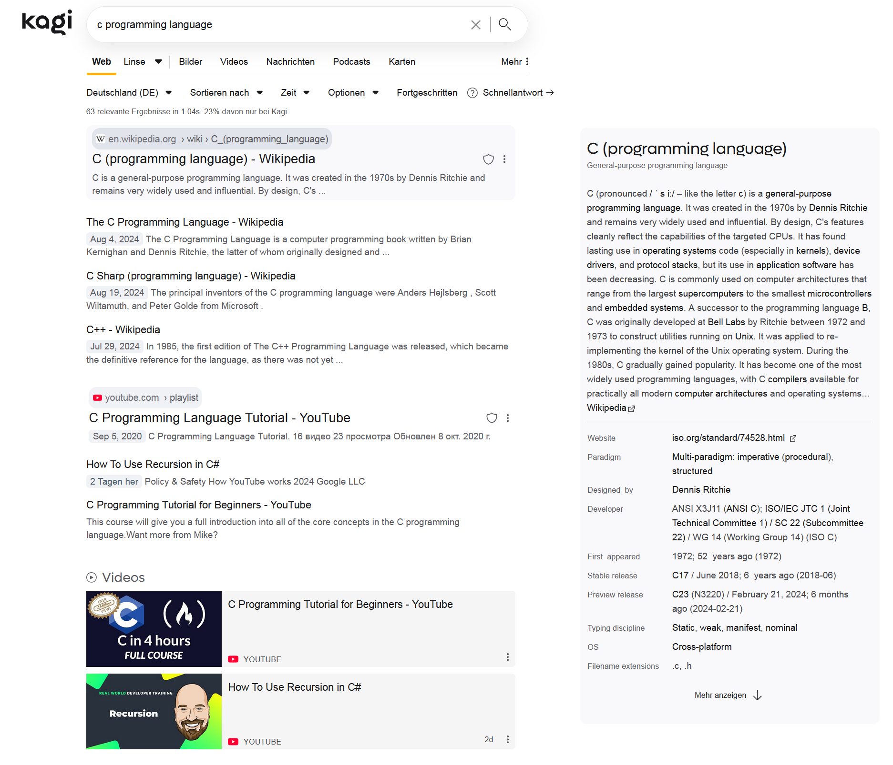
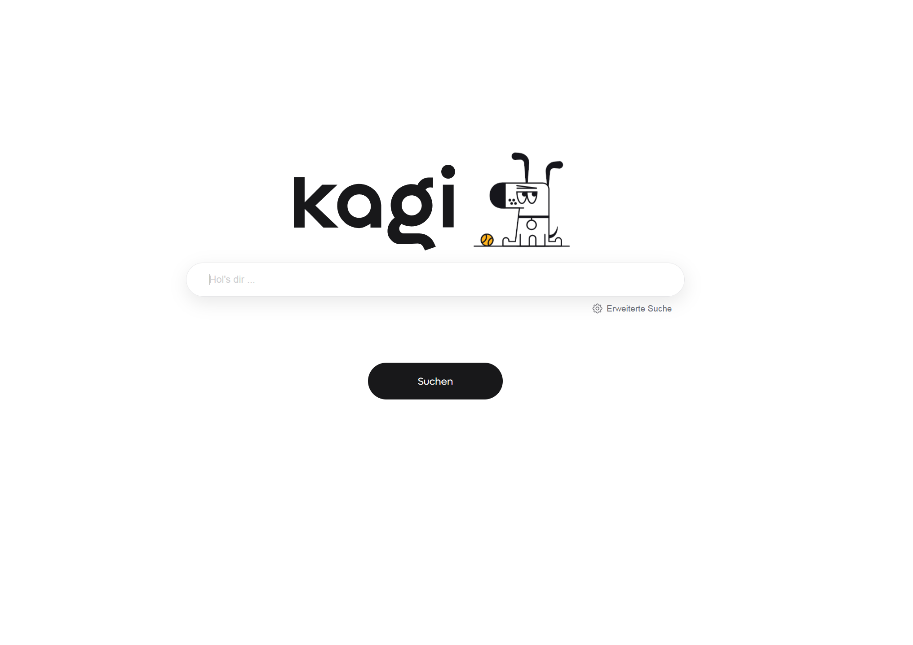
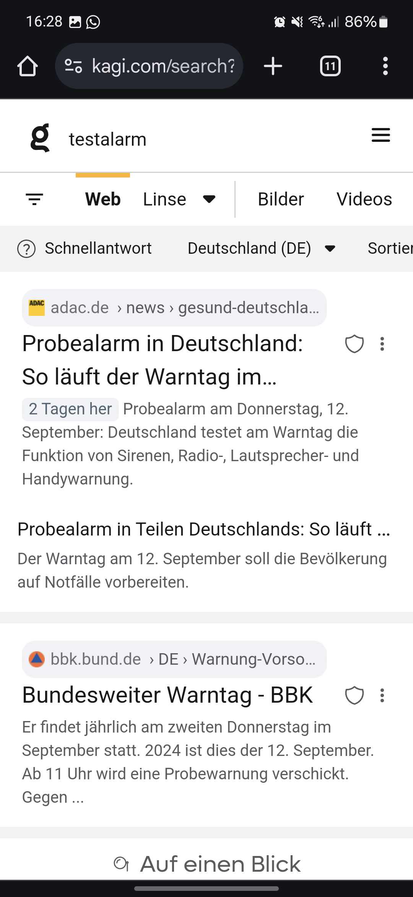

# Kagi Light Search

Experience the Kagi search with a new light mode theme that is simple, intuitive and designed with smooth animations. Inspired by modern design [The Collaboratory - Refine Search](https://dribbble.com/shots/20838286-The-Collaboratory-Refine-Search).

---

---

---

---

---

---

## Overview

**Kagi Light Search** is a custom CSS theme that modernizes the user interface of the Kagi search engine and provides a more pleasant, uncluttered user experience.

## Features

- **Light Mode Design**: Bright and clear color scheme for a fresh search experience
- **Simple animations**: Subtle animations that bring the design to life
- **Responsive design**: Optimized for desktop and mobile devices

## Installation

1. Download the `custom.css` file from this repository.
2. Enable custom CSS in Kagi Settings.
3. Paste the code into the inputfield at: [Link](https://kagi.com/settings?p=custom_css)
4. Save and enjoy your enhanced Kagi experience!

## Ideas or comments?

If you have any suggestions for improvement or find bugs, feel free to contact us on Discord. Have fun with your improved Kagi search experience!